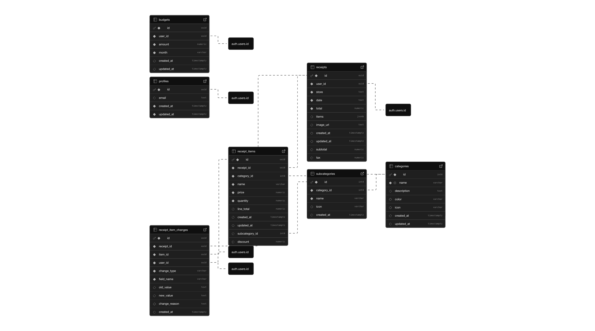

# CS452-Final-Project

# 🧾 Receipt Scanner App

## 📱 Project Overview
The **Receipt Scanner App** helps users manage their expenses and understand their spending habits by scanning and analyzing receipts.  
Using OCR (Optical Character Recognition), the app automatically extracts item details, categorizes purchases, and provides weekly and monthly summaries — including insights into spending patterns and nutritional balance.

---

## 🎯 Purpose and Goals

### **Purpose**
To make expense and nutrition tracking effortless by turning paper receipts into meaningful data visualizations.

### **Goals**
- **Digitize Receipts:** Users can scan or upload receipts directly from their phone.
- **Automatic Item Recognition:** Extract item names, prices, and stores using OCR.
- **Categorization:** Classify each item into categories (e.g., food, groceries, transportation).
- **Spending Analysis:** Show total expenses by week or month.
- **Nutritional Insights:** Analyze food-related purchases to estimate nutritional balance.
- **Visualization Dashboard:** Display clean, interactive charts of user spending and nutrition trends.

---

## 🧠 Tech Stack

| Layer | Technology |
|-------|-------------|
| **Frontend** | React Native + Expo |
| **Backend** | Supabase (Auth, PostgreSQL, Storage) |
| **OCR** | Google Vision API / Gemini-2.5-flash |
| **Visualization** | Chart.js / Recharts |
| **Language** | JavaScript / TypeScript |

---

## 🖼️ ERD
*(See the image below for database schema)*  

---

## 🕒 Project Work Log

| Date | What | Hours |
|------|------|-------|
| 11/04/2025 | Planned database structure and created ERD in Supabase | 2 |
| 11/05/2025 | Wrote README and outlined project goals and architecture and Created Git repo | 2 |
| 11/07/2025 | Design work flow and UI | 4 |
| 11/08/2025 | Created Backend feature and implement OCR | 4 |
| 11/10/2025 | Debugging | 2 |
| 11/11/2025 | Debugging | 2 |
| 11/13/2025 | Prompt Engineering | 2 |
| 11/14/2025 | Analysis feature added | 4 |
| 11/16/2025 | Added Categories to Recipes | 2 |
| 11/18/2025 | Debugging | 2 |
| 11/19/2025 | Added selecting image from gallery feature | 2 |
| 11/20/2025 | Added budget tracking | 1 |
| 11/21/2025 | Added Calendar | 2 |
| 11/22/2025 | Added Google Auth | 2 |

| **Total** |  | **33** |

---

